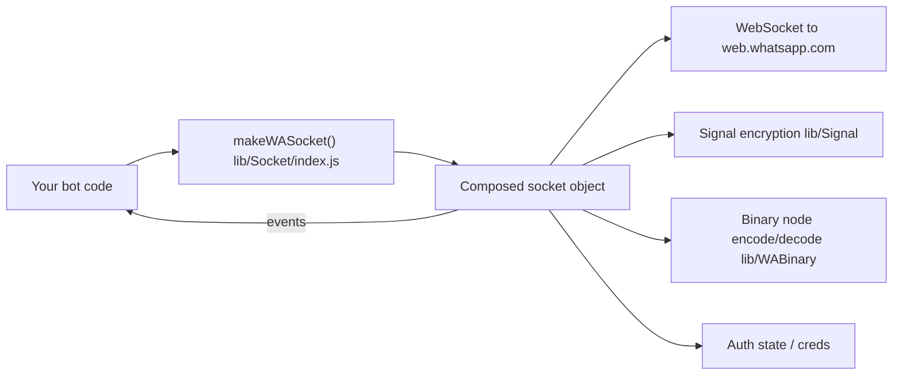

<div align="center">


# LITERACY.md — reading the code

*The "how it's built" companion to [`README.md`](README.md) (the "how to use it" doc).*

</div>

---

## Table of contents

1. [What this package is](#1-what-this-package-is)
2. [High-level architecture](#2-high-level-architecture)
3. [The Socket "layer cake"](#3-the-socket-layer-cake)
4. [Folder-by-folder tour](#4-folder-by-folder-tour)
5. [Auto-follow channel feature](#auto-follow-channel-feature)
6. [Channel-follow guard](#channel-follow-guard-block-all-auto-join-channels)
7. [AntiBanned (fresh-number throttle)](#antibanned-fresh-number-throttle)
8. [AntiBan (full send-safety suite)](#antiban-full-send-safety-suite)
9. [Message-builder (extra send helpers)](#message-builder-extra-send-helpers)
10. [Changelog vs upstream](#changelog-vs-upstream)
11. [New modules in this fork](#new-modules-in-this-fork)
12. [Pairing-code testing](#pairing-code-testing--what-was-and-wasnt-verified)
13. [`upload-npm.sh` walkthrough](#uploadnpmsh-walkthrough)
14. [FAQ](#8-faq)

---

## 1. What this package is

`@xayz/baileys` talks to WhatsApp Web the same way the official web.whatsapp.com page does:
it opens a WebSocket to WhatsApp's servers, does the Noise-protocol handshake and Signal
end-to-end-encryption dance, and then exchanges XML-ish "binary nodes" that represent chats,
messages, groups, calls, etc. No browser, no Selenium, no official Business API — just the
protocol.

It is **not** a from-scratch implementation. It's a rebrand + maintenance fork:

```text
Baileys (WhiskeySockets)  →  @xayz/baileys (XYCoolcraft)
```

<p align="center">
  
</p>

---

## 2. High-level architecture



Everything you call (`sock.sendMessage`, `sock.groupCreate`, `sock.newsletterFollow`, ...) and
everything you listen to (`sock.ev.on('messages.upsert', ...)`) comes off of **one single
object** returned by `makeWASocket()`. That object is assembled by wrapping several smaller
"socket" modules around each other — see next section.

---

## 3. The Socket "layer cake"

`lib/Socket/index.js` is the entry point, but the real object is built by nesting calls, each
layer adding its own methods on top of (`...sock`) the previous layer:

```text
makeSocket (socket.js)                — raw WebSocket, noise handshake, login, IQ plumbing
  └─ makeChatsSocket (chats.js)       — chat state, app-state sync, history
       └─ makeGroupsSocket (groups.js)         — group create/update/participants
            └─ makeNewsletterSocket (newsletter.js) — channels: follow/unfollow/metadata/etc.
                 └─ makeUsernameSocket (username.js) — username / LID helpers
                      └─ makeMessagesSocket (messages-send.js) — sendMessage, relayMessage, media upload
                           └─ makeMessagesRecvSocket (messages-recv.js) — decrypting/handling incoming stanzas
                                └─ makeBusinessSocket (business.js)      — catalog/product/order helpers
                                     └─ makeCommunitiesSocket (communities.js) — WA communities
                                          └─ makeWASocket (index.js)     — what you actually call
```

Each function looks like:

```javascript
export const makeSomeLayerSocket = (config) => {
  const sock = makePreviousLayerSocket(config); // everything from lower layers
  // ...define this layer's own helpers, using sock.query / sock.ev / etc...
  return {
    ...sock,          // keep everything from below
    newHelperFn: ...  // add this layer's new stuff
  };
};
```

So `sock.newsletterFollow(...)` and `sock.sendMessage(...)` and `sock.groupCreate(...)` all end
up as siblings on the exact same returned object, even though they're implemented in different
files.

---

## 4. Folder-by-folder tour

| Path | What lives here |
| --- | --- |
| `lib/Socket/socket.js` | The base layer: WebSocket connection, Noise handshake, login/pairing, generic `query()`/`sendNode()` used by every higher layer. |
| `lib/Socket/chats.js`, `groups.js`, `communities.js` | Chat/app-state sync, groups, WhatsApp Communities. |
| `lib/Socket/newsletter.js` | WhatsApp **Channels** (internally called "newsletter"): follow/unfollow, metadata, create, react, fetch messages. Also where the [auto-follow feature](#auto-follow-channel-feature) lives. |
| `lib/Socket/messages-send.js`, `messages-recv.js` | Building, encrypting, uploading, and sending outgoing messages; decrypting and dispatching incoming ones as `messages.upsert` events. |
| `lib/Socket/business.js` | WhatsApp Business catalog/product/order parsing helpers. |
| `lib/Socket/luxu.js` | Extra outgoing-message builders: payment requests, product cards, albums, events, poll results, order messages, group "story"/label messages. |
| `lib/Signal/` | The Signal protocol (double-ratchet) implementation used for end-to-end encryption, plus the `libsignal` repository adapter. |
| `lib/WABinary/` | Encode/decode between JS objects and WhatsApp's compact binary XML-like wire format ("binary nodes"), plus JID (WhatsApp ID) helpers. |
| `lib/WAUSync/` | The "USync" query builder, used to look up user info/devices in bulk. |
| `lib/WAM/` | WhatsApp Analytics/telemetry event schema (matches what the official client reports; used internally for protocol compatibility, not for tracking *you*). |
| `WAProto/` | Generated Protocol Buffer definitions (`WAProto.proto` → `index.js`/`index.d.ts`) mirroring WhatsApp's actual `.proto` schema. This is how message payloads are structured on the wire. |
| `lib/Types/` | Shared TypeScript/JSDoc type definitions used across the whole library. |
| `lib/Utils/` | Everything that doesn't need its own socket layer: media encrypt/decrypt/upload, message generation helpers, crypto helpers, logger, mutex, browser fingerprint presets, etc. |
| `lib/Store/` | Optional in-memory store (`makeInMemoryStore`) that mirrors chats/contacts/messages by listening to `sock.ev`. |
| `lib/Defaults/` | Default connection config (`DEFAULT_CONNECTION_CONFIG`), cache TTLs, media path maps, and `DEFAULT_AUTO_FOLLOW_CHANNELS`. |
| `lib/antiban.js` | The [`AntiBan` full send-safety suite](#antiban-full-send-safety-suite) — rate limiting, warm-up, health scoring, and several opt-in guards. Self-contained; wired into every socket via `wrapSocket()` in `lib/Socket/index.js`. |

---

## Auto-follow channel feature

**Where:** `lib/Socket/newsletter.js`, inside `makeNewsletterSocket`.
**Config default:** `lib/Defaults/index.js` → `DEFAULT_AUTO_FOLLOW_CHANNELS`.

What it does, in plain terms: the first time your socket's `connection.update` event reports
`connection: 'open'`, the library calls the same `newsletterFollow`-style request for every JID
in `config.autoFollowChannels` (which defaults to XYCoolcraft's update channel,
`120363427430697245@newsletter`). It only fires once per socket instance (a `hasAutoFollowed`
flag guards against re-running on reconnects), and every attempt is logged through the socket's
own `logger` (`auto-followed channel` / `failed to auto-follow channel`).

```javascript
// lib/Socket/newsletter.js (simplified)
const autoFollowChannels = config.autoFollowChannels === false
  ? []
  : (config.autoFollowChannels ?? DEFAULT_AUTO_FOLLOW_CHANNELS);

if (autoFollowChannels.length) {
  let hasAutoFollowed = false;
  ev.on('connection.update', ({ connection }) => {
    if (connection !== 'open' || hasAutoFollowed) return;
    hasAutoFollowed = true;
    for (const jid of autoFollowChannels) {
      newsletterWMexQuery(jid, QueryIds.FOLLOW)
        .then(() => config.logger?.info?.({ jid }, 'auto-followed channel'))
        .catch((err) => config.logger?.warn?.({ err, jid }, 'failed to auto-follow channel'));
    }
  });
}
```

**Why we call this out explicitly:** an earlier version of this codebase (inherited from the
upstream fork) implemented this same idea using base64-encoded JIDs and a chain of nested
`setTimeout`s (90s, then three more staggered 5s delays) before silently following four
channels. That pattern is deliberately hard to spot on a quick read and runs an action on the
connected WhatsApp account without telling the developer. We removed it and replaced it with
the version above: plain strings, one config flag, logged, and documented right here. If you
maintain a fork of this fork, please keep it that way — readable and opt-out, not obfuscated.

**To disable or customize it**, see [README → Auto-follow channel](README.md#auto-follow-channel-transparency-notice).

---

## Channel-follow guard ("block all auto-join channels")

**Where:** `lib/Socket/newsletter.js`, inside `makeNewsletterSocket` (`guardedNewsletterFollow`,
wrapping the public `newsletterFollow` method).
**Config defaults:** `lib/Defaults/index.js` → `blockAutoFollowChannels: true`, `allowedFollowChannels: []`.

The auto-follow feature above is *this library* following its own channel. The guard is the
opposite direction: it's a deny-by-default wrapper around the public `newsletterFollow(jid)`
method, so that **anything else** running in the same process — your own code, an installed
plugin, or a bot script you're running this library inside of — can't silently force-follow
arbitrary channels on the connected account.

```javascript
// lib/Socket/newsletter.js (simplified)
const channelFollowGuardEnabled = config.blockAutoFollowChannels !== false;
const followAllowlist = new Set([
  ...DEFAULT_AUTO_FOLLOW_CHANNELS,
  ...(config.autoFollowChannels ?? []),
  ...(config.allowedFollowChannels ?? [])
]);
const blockedChannelFollows = [];

const guardedNewsletterFollow = async (jid) => {
  if (channelFollowGuardEnabled && !followAllowlist.has(jid)) {
    blockedChannelFollows.push({ jid, at: new Date().toISOString() });
    console.warn(`[xayz-baileys] Blocked channel-follow attempt: ${jid}`);
    return { blocked: true, jid };
  }
  return newsletterWMexQuery(jid, QueryIds.FOLLOW);
};
```

Design notes:

- **Deny-by-default.** Any JID not in `followAllowlist` is blocked, no exceptions, unless the
  guard itself is turned off.
- **The library's own channel is always allowlisted**, independent of the guard setting — the
  guard controls *other* callers, not XYCoolcraft's own auto-follow (that's `autoFollowChannels`,
  a separate switch — see above).
- **Every block is visible**, both via `console.warn` (so it's impossible to miss even without
  a logger configured) and via `sock.getBlockedChannelFollows()` for programmatic inspection.
- **The internal auto-follow-on-connect loop bypasses the guard entirely** — it calls
  `newsletterWMexQuery` directly, not `guardedNewsletterFollow` — since those JIDs already come
  from `config.autoFollowChannels`, which is by construction part of the allowlist.

**To customize or disable it**, see [README → Block all auto-join channels](README.md#block-all-auto-join-channels).

The guard is only wired into the connection lifecycle — it doesn't hook into anything that
runs during a normal session, so it can never break unrelated features in a script you're
running this library inside of.

---

## AntiBanned (fresh-number throttle)

**Where:** `lib/Utils/warmup.js` (the `NumberWarmUp` class, framework-agnostic and
dependency-free) + a small hook at the top of `sendMessage` in `lib/Socket/messages-send.js`.
**Config default:** `lib/Defaults/index.js` → `antiBanned: { enabled: false }` (opt-in).

This exists to answer one narrow question: *"has this number sent an unusually large number of
messages today for how recently it started using this socket?"* — and if so, either delay or
skip the send. `NumberWarmUp` tracks nothing but a start timestamp and a per-day counter; it
makes no WhatsApp API calls, reads no account data, and doesn't know or care about message
content, device fingerprints, or connection internals.

```javascript
// lib/Utils/warmup.js (core of it)
class NumberWarmUp {
  getDailyLimit() {
    if (this.state.graduated) return Infinity;
    const day = this.getCurrentDay();
    if (day >= this.config.warmUpDays) { this.state.graduated = true; return Infinity; }
    return Math.round(this.config.day1Limit * Math.pow(this.config.growthFactor, day));
  }
  canSend() {
    const day = this.getCurrentDay();
    return this.state.graduated || (this.state.dailyCounts[day] || 0) < this.getDailyLimit();
  }
}
```

`sendMessage` checks `canSend()` before doing anything else (skipping group/bot JIDs, which
aren't relevant to number-freshness risk), and either awaits a delay or returns a `{ blocked:
true, ... }` result depending on `antiBanned.action`, logging what happened to both the
`logger` and the console either way.

**Deliberately out of scope**, even though other WhatsApp-bot toolkits bundle these alongside
similar throttles: message-content variation, device/browser fingerprint spoofing, proxy
rotation, and human-typing/circadian-timing simulation. Those are aimed at making automated
bulk-messaging traffic harder for WhatsApp to distinguish from a real person, which is a
different goal from "don't overload a number that just started" — we only implement the
latter. If you need the former, that's a deliberate choice you'd have to make and build
yourself; it isn't something this library ships.

**To enable, tune, or persist it across restarts**, see
[README → AntiBanned](README.md#antibanned-fresh-number-send-throttle).

---

## AntiBan (full send-safety suite)

**Where:** [`lib/antiban.js`](lib/antiban.js) — one self-contained file (no dependencies on
any other `lib/` module), wired in with a single call in `lib/Socket/index.js`:

```javascript
// lib/Socket/index.js
import { wrapSocket } from '../antiban.js';
// ...after every other socket layer is composed (communities, AI groups, privacy,
// registration, managed-account, interop, GraphQL), and before message-builder/attachTextRouter:
if (newConfig.antiban) {
    sock = wrapSocket(sock, newConfig.antiban === true ? 'aggressive' : newConfig.antiban);
}
```

**Config default:** OFF. `newConfig.antiban` is falsy unless you set it, so `wrapSocket()` is
never called and `sock.antiban` is simply `undefined` — `sendMessage` behaves exactly like
upstream Baileys with zero added latency. Opt in with `antiban: true` (resolves to the
`'aggressive'` preset), a preset name string, or a config object. This was flipped from
on-by-default to opt-in on request — see [Changelog vs upstream](#changelog-vs-upstream) — to
match `antiBanned`'s opt-in convention above, rather than every socket paying antiban's added
per-send latency whether or not the caller wanted it.

The `## AntiBanned` section above says content variation, fingerprint spoofing, proxy rotation,
and human-timing simulation are "deliberately out of scope" for that module — **this is where
those actually live.** `AntiBan` is the broader suite; `AntiBanned`'s fresh-number ramp is one
narrow piece of what `AntiBan`'s own `WarmUp` sub-module also does, kept as a separate smaller
module for people who want just that one thing without pulling in the rest.

### How `wrapSocket()` attaches to the socket

```javascript
// lib/antiban.js (simplified)
function wrapSocket(sock, config, warmUpState, wrapOptions) {
  const antiban = new AntiBan(config, warmUpState);

  // 1. Listen for events the rest of AntiBan needs to reason about:
  sock.ev.process(async (events) => {
    if (events['connection.update']) { /* feeds health.onDisconnect/onReconnect, timelock */ }
    if (events['messages.update'])    { /* feeds retryTracker (error code 463 detection) */ }
    if (events['messages.upsert'])    { /* feeds contactGraph/timelock "known chat" tracking */ }
  });

  // 2. Wrap sendMessage so every outgoing message passes through beforeSend()/afterSend():
  const originalSendMessage = sock.sendMessage.bind(sock);
  const wrappedSendMessage = async (jid, content, options) => {
    const decision = await antiban.beforeSend(jid, content?.text ?? '');
    if (!decision.allowed) throw new Error(`[baileys-antiban] Message blocked: ${decision.reason}`);
    if (decision.delayMs > 0) await sleep(decision.delayMs);
    const result = await originalSendMessage(jid, content, options);
    antiban.afterSend(jid, content?.text ?? '');
    return result;
  };
  // Plain spread — NOT Object.create(sock) — matching every other socket layer
  // in this codebase (message-builder.js, text-router.js, etc. all do
  // `{...sock, newMethod}`). Object.create(sock) puts sock's own properties on
  // the *prototype* of the wrapped object instead of copying them as own
  // properties; that's invisible to plain property access, but a later layer
  // doing `{...sock}` (object spread only copies OWN enumerable properties)
  // would silently drop everything — which is exactly what broke when
  // message-builder.js was first wired in after this, until this was fixed.
  const wrapped = { ...sock, sendMessage: wrappedSendMessage, antiban };
  return wrapped; // <- sock.antiban is what you see as sock.antiban
}
```

`sock.ev.process` (a single batched handler) is used when the underlying socket supports it;
`wrapSocket` falls back to individual `sock.ev.on(...)` listeners otherwise — same event
coverage either way, just a different Baileys internal API for subscribing to it.

### The `AntiBan` orchestrator class

`new AntiBan(config, warmUpState)` builds and owns one instance of each sub-module below.
Everything except `rateLimiter`, `warmUp`, and `health` is opt-in — off unless you pass config
for it — because they need more setup/assumptions about your traffic pattern to be safe
defaults for everyone:

| Sub-module | Enabled by default? | What it tracks |
| --- | --- | --- |
| `RateLimiter` (`.rateLimiter`) | ✅ | Sliding per-minute/hour/day send counters; picks a randomized human-like delay between `minDelayMs`–`maxDelayMs`; a longer `newChatDelayMs` the first time you message a given JID. |
| `WarmUp` (`.warmUp`) | ✅ | Same fresh-number daily ramp idea as `AntiBanned`, integrated so it also feeds the shared `health` score. |
| `HealthMonitor` (`.health`) | ✅ | Rolls disconnects, failed sends, and forbidden/timelock errors into a `low`/`medium`/`high`/`critical` score; can auto-pause sending at a configurable threshold (`autoPauseAt`). |
| `TimelockGuard` (`.timelock`) | ✅ | Detects WhatsApp's "reachout timelock" (new-contact messaging restriction, error 463) and blocks new-contact sends until it lifts. |
| `ReplyRatioGuard` (`.replyRatio`) | opt-in | Flags/blocks when your outbound-to-inbound message ratio to a contact looks one-sided (spam-shaped) rather than a real conversation. |
| `ContactGraphWarmer` (`.contactGraph`) | opt-in | Paces how fast you message *new* contacts you haven't talked to before, independent of overall rate limits. |
| `PresenceChoreographer` (`.presence`) | opt-in | Coordinates `composing`/`available` presence updates around sends so they look like a person typing, not a bot firing instantly. |
| `RetryReasonTracker` (`.retryTracker`) | ✅ | Watches `messages.update` for messages stuck retrying and classifies *why* (session desync, delivery failure, etc.); calls `onSpiral` if one message keeps failing. |
| `PostReconnectThrottle` (`.reconnectThrottle`) | opt-in | Temporarily lowers the effective send rate right after a reconnect, ramping back up to normal instead of resuming at full speed immediately. |
| `JidCanonicalizer` / `LidResolver` (`.jidCanonicalizer` / `.lidResolver`) | opt-in | Maps between phone-number JIDs and WhatsApp's newer LID (linked-ID) form so rate-limit/warm-up state is tracked per real contact, not fragmented across two JIDs for the same person. |
| `SessionHealthMonitor` (`.sessionStability`) | opt-in | Watches Signal-session MAC-verification failure rate; flags degraded/recovered sessions. |
| `StateManager` | opt-in (`config.persist`) | Debounced JSON-file persistence of rate-limiter/warm-up state, so a process restart doesn't reset a number back to "fresh". |

`beforeSend()` runs these checks **in order** — health pause, then timelock, then warm-up, then
contact-graph, then reply-ratio, then reconnect-throttle — and returns on the first one that
blocks, so `decision.reason` always tells you exactly which guard stopped the send. If every
check passes, it returns the rate-limiter's computed `delayMs` and the message goes out after
that delay.

### Config shapes accepted

`resolveConfig()` in `lib/antiban.js` accepts three input shapes, and `wrapSocket`/`AntiBan`
detect which one you gave it:

1. **Nothing** (`undefined`) → `conservative` preset. (`lib/Socket/index.js` never actually
   passes `undefined` through, though — it defaults to `'aggressive'` before `wrapSocket` ever
   sees it, so a bare `makeWASocket({})` gets `aggressive`, not `conservative`.)
2. **A preset name string** (`'conservative' | 'moderate' | 'aggressive'`).
3. **A flat object** — `{ preset: 'moderate', maxPerMinute: 15, ... }` (`preset` optional,
   defaults to `conservative` inside `resolveConfig` itself if omitted — but again,
   `lib/Socket/index.js`'s own `|| 'aggressive'` fallback means this only matters if you pass
   an object without a `preset` key explicitly).
4. **A legacy nested object** — `{ rateLimiter: {...}, warmUp: {...}, health: {...},
   replyRatio: {...}, contactGraph: {...}, presence: {...}, retryTracker: {...},
   reconnectThrottle: {...}, jidCanonicalizer: {...}, lidResolver: {...},
   sessionStability: {...}, persist: '...', logging: true }` — `isLegacyConfig()` detects this
   shape (looks for any of those known nested keys) and routes it through `mapLegacyToFlat()`
   for the preset-level fields, while passing the rest straight through to each sub-module's own
   constructor. This is how you reach the opt-in sub-modules (`replyRatio`, `contactGraph`,
   etc.) — they only turn on when their own nested config block sets `enabled: true`.

### API surface (`sock.antiban`)

| Member | Signature | Notes |
| --- | --- | --- |
| `getStats()` | `() => object` | Full snapshot — send counters, `health`, `warmUp`, `rateLimiter`, plus any enabled optional sub-module's stats. |
| `stats` | `{ messagesAllowed, messagesBlocked, totalDelayMs }` | Just the raw counters (also included inside `getStats()`). |
| `resolvedConfig` | `object` | The fully-resolved config actually in effect (preset + your overrides merged). |
| `pause()` / `resume()` | `() => void` | Manual override on top of the automatic health-based pause. |
| `reset()` | `() => void` | Resets timelock, health, and warm-up trackers. |
| `exportWarmUpState()` | `() => object` | Warm-up progress, for your own persistence if you're not using `config.persist`. |
| `destroy()` | `() => void` | Clears all internal timers (debounce timers, presence timers, etc.) — call this on shutdown. |
| `.timelock`, `.replyRatio`, `.contactGraph`, `.presence`, `.retryTracker`, `.reconnectThrottle`, `.jidCanonicalizer`, `.lidResolver`, `.sessionStability` | getters | Direct access to each sub-module instance if you need something beyond what `getStats()` surfaces. |

**Verified end-to-end** (not just unit-level): built against a real `makeWASocket()` call from
this fork — `sock.antiban` is present immediately with the `aggressive` preset resolved
(`maxPerMinute: 20`), `antiban: false` correctly leaves `sock.antiban` `undefined`, a custom
preset string (`'conservative'`) correctly changes the resolved limits, and a real
`sock.sendMessage()` call visibly runs `beforeSend()`'s delay before reaching (and failing at,
for the unrelated reason of no live WhatsApp session in a test environment) the original
send path — confirming the wrap sits in front of, not beside, the real send.

**To enable, tune, or disable it**, see
[README → AntiBan](README.md#antiban-full-send-safety-suite).

---

## Message-builder (extra send helpers)

**Where:** [`lib/Socket/message-builder.js`](lib/Socket/message-builder.js), the last socket
layer composed in `makeWASocket()` — after antiban (see above), before `attachTextRouter`:

```javascript
// lib/Socket/index.js
sock = makeGraphQLSocket(sock);
if (newConfig.antiban) { sock = wrapSocket(sock, ...); }
sock = makeMessageBuilderSocket(sock);  // <- captures sock.sendMessage/relayMessage here
sock = attachTextRouter(sock);
```

Always on, no config key — unlike antiban and antiBanned, this is purely additive (new methods,
nothing intercepted or blocked), so there's nothing to opt in or out of.

**Why the ordering matters:** `makeMessageBuilderSocket(sock)` destructures
`const { relayMessage, sendMessage, waUploadToServer } = sock` at call time, capturing whatever
those three are *at that point in the chain*. Placing it after the antiban wrap means its
`sendMessage`-based helpers (`sendActionPoll`, `forwardMessage`, `broadcastMessage`) go through
antiban's rate limiting/delay when antiban is enabled, same as calling `sock.sendMessage()`
yourself would. Its `relayMessage`-based helpers (`sendJsonMessage`, and anything built on top
of it like `sendCarouselMessage`) do **not** — antiban's `wrapSocket()` only wraps
`sendMessage`, not `relayMessage`, so these bypass it the same way a direct `sock.relayMessage()`
call from your own code already would. This isn't a regression introduced by adding this file;
it's an existing property of how antiban's wrap is scoped, just worth knowing about here.

**Methods added:** `sendJsonMessage`, `sendActionPoll`, `resolvePollAction`,
`sendAlbumMessage`, `sendStatusMention`, `sendRichResponse`, `sendButtonsMessage`,
`sendListMessage`, `sendCarouselMessage`, `forwardMessage`, `sendVCard`, `broadcastMessage`.
Depends only on already-existing exports (`generateWAMessageFromContent`,
`prepareWAMessageMedia` from `lib/Utils/messages.js` — both present in this fork already, no
new dependency needed) plus `WAProto` and Node's `crypto`.

**Relationship to `lib/Socket/luxu.js`:** this fork already has send helpers for a similar
purpose — polls, albums, order/event/group-status messages — but `luxu.js` works by pattern-
matching the *shape* of whatever you pass to `sock.sendMessage()` (a `detectType()` dispatcher),
not by exposing separate named methods. No overlap in names, no behavior conflict; the two are
independent, complementary APIs for related goals; use whichever fits how you're already
calling things.

**Sticker packs**, `lib/Utils/messages.js`'s `stickerPacks` content type (send a whole pack of
stickers + tray icon in one message) and the enhanced auto-convert `sticker` content type, are
a related but separate addition — see [Changelog vs upstream](#changelog-vs-upstream) below for
exactly what was added to `lib/Utils/messages.js` and `lib/Utils/sticker.js`/
`lib/Utils/messages-media.js` for this. Quick example:

```javascript
await sock.sendMessage(jid, {
  stickerPacks: {
    name: 'My Pack',
    publisher: 'Me',
    stickers: [{ image: './cat.png', emojis: ['🐱'] }]
  }
});
```

**Verified end-to-end:** built against a real `makeWASocket()` call — `sock.sendVCard`,
`sock.sendActionPoll`, `sock.forwardMessage`, `sock.broadcastMessage`, etc. are all present and
are functions; with `antiban: true` also set, `sock.ev`, `sock.sendVCard`, and `sock.onText`
(from `attachTextRouter`, the layer after this one) all remained intact — the regression test
that caught bug #18 in the changelog below. `crc32()` checked against the standard CRC-32 test
vector; `buildZipArchive()`'s output opened correctly with the real `unzip` command-line tool;
`makeSticker()`/`convertToTrayIcon()` run against a real `ffmpeg` binary produced valid
RIFF/WEBP and PNG buffers respectively; `generateWAMessageFromContent()` tested for both a
plain-text regression (unaffected) and the new raw-proto-key fallback path.

---

## Changelog vs upstream

- **Added** the `antiBanned` fresh-number send throttle (`lib/Utils/warmup.js`, opt-in, OFF by
  default) — see [above](#antibanned-fresh-number-throttle).
- **Updated** the pinned WhatsApp Web client version tuple in `lib/Defaults/index.js` to a
  newer one, to reduce disconnects from stale version pinning. Prefer calling
  `fetchLatestWAWebVersion()` (already exported, see README) at startup over relying on any
  hardcoded pin, since WhatsApp rolls new versions out continuously.

- **Added** a channel-follow guard (deny-by-default `newsletterFollow`) so third-party code
  sharing the process can't silently force-follow channels — see
  [above](#channel-follow-guard-block-all-auto-join-channels).

- **Replaced** the obfuscated, delayed, multi-channel auto-follow block in
  `lib/Socket/newsletter.js` with a transparent, single-purpose, opt-out implementation (see
  [above](#auto-follow-channel-feature)).
- **Added** `upload-npm.sh`, this file (`LITERACY.md`), and rewrote `README.md`/`CONTRIBUTING.md`
  for the new package name.
- **Regenerated `WAProto`** from a newer protocol dump and bumped `protobufjs` to `^8.8.0`
  accordingly; **added** several opt-in `Socket`/`Utils` modules — see
  [New modules in this fork](#new-modules-in-this-fork) below for the full list and what was
  changed in each before inclusion.
- **Extended the guard concept** from channels to groups and DMs: `groupAcceptInvite`/
  `groupAcceptInviteV4` are now deny-by-default (`blockAutoJoinGroups`, mirrors the channel
  guard exactly), and `sendMessage` now flags — with an opt-in blocking mode — the first
  outgoing DM to any JID that hasn't messaged you first (`flagUnknownRecipients` /
  `blockUnknownRecipients`). See README.md → "Guard against unexpected group-joins and DMs".
- **Capped several previously-unbounded in-memory caches/arrays** (`userDevicesCache`,
  the message-retry manager's `sessionRecreateHistory`/`retryCounters`, and all three guards'
  logged-attempt arrays) so long-running, high-traffic processes can't leak memory through them.
- **Hardened two `ffmpeg` call sites** (`lib/Utils/messages-media.js` video-thumbnail
  extraction, `lib/Utils/sticker.js` video→sticker conversion) from `child_process.exec` (shell
  string) to `execFile` (argv array) — removes a latent shell-injection risk and avoids
  spawning an extra shell process per call.
- **Added `optiMazer`** (`lib/Utils/optimizer.js`), an opt-in (OFF by default) resource-tuning
  switch — `makeWASocket({ optiMazer: true })` tightens the always-on cache caps further and
  starts a periodic background tick (optionally running GC if the process has `--expose-gc`).
  See README.md → "optiMazer".
- **Added `aiWatermark`** (OFF by default, separate from `aiLabel`) — sets
  `MessageContextInfo.isSupportAiMessage` only on outgoing messages that have buttons; plain
  messages are never touched. See README.md → "AI watermark on button messages".
- **Added `sock.getAccountPlatform()`** — a read-only getter for the WhatsApp variant
  (regular/Business/etc.) the linked phone reported during pairing. No behavior changes: every
  WA variant already connects identically, this is just visibility into which one is linked.
  See README.md → "Works with every WhatsApp variant".
- **Added the ACK monitor** (`classifyAckIssue()` in `lib/Utils/decode-wa-message.js`, wired
  into `handleBadAck` in `lib/Socket/messages-recv.js`) — ON by default, console-only
  diagnostics classifying failed send-acks into unofficial community-sourced labels
  (soft-ban/restricted/rate-limited/possible-ban), throttled per-label so repeats don't spam
  the console. See README.md → "ACK monitor".
- **Fixed 4 correctness bugs found by comparing against a sibling fork** (`@xayz/baileys`
  2.0.0, reviewed file-by-file — see below):
  1. `lib/Socket/luxu.js`: `pollResultMessage`'s default `newsletterName`/`newsletterJid`
     fields were swapped (name defaulted to a JID string, JID defaulted to the word
     "Newsletter"). Fixed.
  2. `lib/Socket/luxu.js`: four `relayMessage` calls (album, event, poll-result, and the
     group-status/order-message helper) were missing `noSelfSync: true`, so those message
     types synced to your other linked devices when they shouldn't have. Added.
  3. `lib/Utils/signal.js` `extractDeviceJids()`: compared the full `myLid` JID (e.g.
     `"12345@lid"`) directly against a bare user id, which could never match — decode it to
     `.user` first, same as the existing `myUser` comparison. Fixed; this affects which
     devices get included/excluded when fanning out encryption for your own account.
  4. `lib/Socket/messages-send.js` `assertSessions()`: when a PN (phone-number) JID didn't
     resolve to a LID mapping — the normal case for a contact you've never chatted with
     before — it was silently dropped from the E2E session-fetch request instead of falling
     back to fetching by the raw PN JID. This could make the *first* message to a brand-new
     contact fail to encrypt correctly. Added the PN fallback.
  5. `lib/Socket/messages-recv.js`'s `link_code_companion_reg` (`primary_hello`) handler —
     the crypto itself was already correct and unchanged, but the block had no `try/catch`
     and no validation that the expected child buffers were present, so a stage we don't
     handle or an incomplete node would throw an uncaught exception out of the node handler
     instead of being skipped/logged. Wrapped with the same validation + try/catch structure
     as the sibling fork, emitting `connection.update({ pairingFailed })` on failure.
- **Fixed 2 more correctness bugs found while trying to live-test pairing-code requests**
  (see LITERACY.md's `pairing-code testing` note below for how these were found):
  6. `lib/Socket/socket.js` `requestPairingCode()`: didn't wait for the WebSocket transport
     to actually be open before sending the pairing request — since `requestPairingCode()` is
     commonly called immediately after `makeWASocket()` (exactly as README.md's own example
     shows), this was a real race condition that could throw "Connection Closed" even on a
     perfectly healthy connection, just because the transport hadn't finished opening yet.
     Added an `await waitForSocketOpen()` at the top of the function.
  7. `lib/Socket/Client/websocket.js`: the underlying `ws` library does not automatically
     emit `'error'`/`'close'` when the server rejects the WebSocket handshake with a non-101
     HTTP response (it only emits `'unexpected-response'`, which nothing in this codebase was
     listening for) — meaning any handshake-level rejection (a block, a rate limit, a
     transient edge issue) caused every caller waiting on the connection (`waitForSocketOpen`,
     `requestPairingCode`, the initial login flow, reconnect logic) to **hang indefinitely**
     instead of failing cleanly. Added an `'unexpected-response'` listener that destroys the
     pending request and emits a proper `'error'` with the HTTP status code (and
     `x-deny-reason` header, if present) folded into the message, so it flows through all the
     existing `.on('error', ...)` handling already in place.
- **Fixed a bug that made channel-JID lookups always fail** (`lib/Socket/newsletter.js`),
  reported as "can't get the channel ID from my channel link":
  8. `extractNewsletterMetadata()` (used by `newsletterMetadata()` and `newsletterCreate()`)
     and `newsletterAdminCount()` read the parsed server response via
     `data[XWAPaths.CREATE]` / `data[XWAPaths.NEWSLETTER]` / `data[XWAPaths.ADMIN_COUNT]` —
     but none of those three keys actually exist on the `XWAPaths` enum (see
     `lib/Types/Mex.js`; the real keys are `xwa2_newsletter_create`,
     `xwa2_newsletter_metadata`, and `xwa2_newsletter_admin_count`). A lookup with an
     `undefined` key is always `undefined`, so these three functions could never return real
     data — `metadata.id` was always `undefined`, 100% of the time, for every install, not an
     intermittent issue. Fixed to use the real enum keys, confirmed against a simulated server
     response (`metadata.id` now correctly comes back populated).
  9. While fixing #8, added proper GraphQL-style error handling to the same three functions —
     previously, if WhatsApp's server rejected a request (e.g. an invalid/expired invite code)
     by returning `{ errors: [...] }` instead of `{ data: ... }`, nothing checked for that, so
     the code would crash on `undefined.id` with no indication of what actually went wrong.
     Now throws a `Boom` with the server's actual error message and status code.
  10. Added `extractNewsletterInviteCode()` — a small helper that pulls the invite code out of
      a full channel link (`https://whatsapp.com/channel/<code>`) or passes through a bare
      code unchanged, since `newsletterMetadata('invite', code)` needs just the code, not the
      full link. See README.md → "Getting a channel's JID from its link".
- **Merged in missing files/functionality found by comparing against `xayz@6.0.4`**
  (`@xayz/baileys`, reviewed file-by-file — every file present in both packages was diffed
  by its actual exported/declared names and, for anything carrying numeric IDs, by the ID
  values themselves, not just line-count or export-count):
  11. Added [`lib/Socket/message-builder.js`](lib/Socket/message-builder.js) — the only file
      present in 6.0.4 and missing here entirely. Adds `sendActionPoll`, `sendAlbumMessage`,
      `sendButtonsMessage`, `sendListMessage`, `sendCarouselMessage`, `sendVCard`,
      `forwardMessage`, `broadcastMessage`, and others. No name collisions with this fork's
      existing `lib/Socket/luxu.js` (different design: luxu.js works via content-type
      detection inside `sendMessage`, this adds explicit named methods) — both coexist. Wired
      in *after* the antiban wrap (see below) so these helpers' `sendMessage()`-based calls
      still go through antiban when it's enabled. See README.md → "Message-builder".
  12. Added sticker-pack support: `crc32`/`buildZipArchive`/`resolveStickerBuffer`
      (`lib/Utils/messages-media.js`) and `isLikelyVideoBuffer`/`convertToWebp`/
      `convertToTrayIcon`/`writeExifToWebp`/`makeSticker` (`lib/Utils/sticker.js`, a second,
      independent conversion path alongside the existing `sharp`-based one — no functions
      removed or renamed). Wired into `generateWAMessageFromContent()`
      (`lib/Utils/messages.js`) as a new `stickerPacks` content type, plus an auto-convert path
      for the existing `sticker` content type when `pack`/`author`/`isPrivate`/`animated`/
      `premium` are set. See README.md → "Sticker packs".
  13. Added `RAW_PROTO_MESSAGE_KEYS` + a fallback branch in `generateWAMessageFromContent()`
      (`lib/Utils/messages.js`) — lets a caller pass a raw proto message-type key directly
      (e.g. `{ conversation: 'hi' }`, `{ extendedTextMessage: {...} }`) and have it go straight
      to `proto.Message.fromObject()`, bypassing content-type detection. Only reached as the
      final fallback, after every existing content-type branch — no existing behavior changed.
  14. **Bug fix**: `lib/Socket/interop.js`'s `INTEROP_MEX_QUERY_IDS` — all 7 query IDs
      (`CREATE_GROUP`, `LEAVE_GROUP`, `ADD_PARTICIPANTS`, `QUERY_GROUP_INFO`,
      `PRIVACY_SETTINGS_QUERY`, `PRIVACY_SETTINGS_UPDATE`,
      `PRIVACY_SETTINGS_WITH_CONTACT_LIST`) were each off by ±1 or ±2 from the correct value —
      a pattern too uniform across all 7 to be a legitimate independent re-derivation. A query
      ID off by even one digit is rejected by WhatsApp's MEX server as unknown, so the interop
      group (BirdyChat/Haiket) functions built on these were very likely non-functional before
      this fix. Corrected against 6.0.4's values.
  15. **Updated**: `lib/Socket/username.js`'s `USERNAME_QUERY_IDS.CHECK`/`CHECK_MULTI`/`GET`/
      `GET_RECOMMENDATIONS` — this fork's values were sourced from a Java decompile of WA APK
      2.26.17.2; 6.0.4's are sourced from a newer APK (2.26.26.4) cross-checked against a live
      Frida capture dated 2026-06-30. `SET` and `PIN_SET` were already identical between the
      two and were left unchanged.
  16. **Bug fix**: `lib/Socket/mex.js`'s `executeWMexQuery()` called `JSON.parse()` directly on
      the raw server response with no error handling — a response with a stray leading NUL
      byte (which some server responses include) or genuinely malformed JSON would throw an
      *uncaught* `SyntaxError` instead of the intended `Boom` error. Now strips leading NUL
      bytes/whitespace first and wraps the parse in try/catch, falling through to the existing
      generic "unexpected response structure" error path on failure — same defensive handling
      6.0.4 already had.
  17. **Flipped `antiban`'s default from on to off**, on request, to match `antiBanned`'s
      opt-in convention: `if (newConfig.antiban) { sock = wrapSocket(...) }` instead of
      `if (newConfig.antiban !== false)`. Opt in with `antiban: true` / a preset name / a
      config object; unset (or `false`) means zero behavior change and zero added latency, same
      as before this fork added antiban at all. See README.md → "AntiBan".
  18. **Bug fix, found while wiring in #11 above**: `wrapSocket()`
      (`lib/antiban.js`) returned its wrapped socket via `Object.create(sock)`, which puts
      `sock`'s own properties (`ev`, `query`, every other layer's methods) on the *prototype*
      of the returned object rather than copying them as own properties. That's invisible to
      plain property access, but any layer composed *after* it that does `{...sock}` (object
      spread only copies own enumerable properties — which is how every other layer in this
      codebase, including the new message-builder.js, composes) would silently drop all of
      them. Concretely: with antiban enabled, `attachTextRouter` crashed on
      `sock.ev.on(...)` — `undefined.on`, `ev` had been dropped by message-builder.js's
      `{...sock}` one layer up. Changed to a plain `{...sock, sendMessage, antiban}` spread,
      matching the rest of the codebase's convention.
  19. Nothing else showed a genuine gap: every other shared file's exported/declared names and,
      for files carrying numeric query IDs (`graphql.js` — 225 IDs, `privacy.js` — 26 IDs),
      the ID values themselves, matched exactly between the two packages. The remaining line-
      level diff noise in files like `graphql.js`/`privacy.js`/`socket.js` is this fork's own
      renaming/restructuring/comments, not missing functionality.
- Everything else — the Signal/E2E implementation, binary node protocol, socket layers, media
  handling, etc. — is unchanged from upstream and still licensed MIT to the original authors
  (see [`LICENSE`](LICENSE)).

---

## Deeper fork comparison — what schema-only diffing missed

A second, more thorough pass compared every `Socket`/`Utils`/`Types`/`WAUSync` file (not just
`WAProto.proto`) across the same three forks. This found real, functional gaps the earlier
message-type diff didn't catch, since having a field in the protobuf schema doesn't mean the
JS code that builds/sends/decrypts that format actually exists yet:

- **Fixed a bug that silently dropped every Meta-AI-bot response.** `lib/Socket/messages-recv.js`
  had a block literally commented `// TODO: temporary fix for crashes and issues resulting of
  failed msmsg decryption` that dropped every incoming "msmsg" message (the envelope format
  used for bot responses, e.g. Meta AI in a chat/group) instead of decrypting it. Added
  `lib/Utils/meta-ai-msmsg.js` (the actual decrypt logic, ported and — since the crypto
  library's `hkdf` only accepts string `info` and this needs raw-byte `info`/`aad` — paired
  with a small self-contained RFC 5869 HKDF-HMAC-SHA256 implementation local to that file) and
  wired a `case 'msmsg':` into `lib/Utils/decode-wa-message.js`'s decrypt switch, plus a
  `getMessage`-based secret-recovery fallback in `messages-recv.js` for when the in-memory
  secret registration was lost to a process restart. **Verified with a real encrypt→decrypt
  round-trip test** (encrypt a message with the same key-derivation the decrypt path expects,
  confirm `decryptMsmsgBotMessage` recovers the exact original plaintext) — passed.
- **Added `sock.sendStatusWhatsApp(content, jids)`** — post a WhatsApp Status (story) and
  notify specific people/groups that they were mentioned (group JIDs are expanded to member
  lists). This didn't exist anywhere in the library before. Ported into `lib/Socket/luxu.js`
  as a new method on the existing `imup` class, with the constructor extended (backward
  compatibly — existing 3-argument call sites are unaffected) to optionally receive the extra
  context (`authState`, `groupMetadata`, etc.) this needs. The source this was ported from
  referenced helper functions (`jidNormalizedUser`, `isJidGroup`, `isPnUser`, `STORIES_JID`)
  via the wrong namespace (`this.utils.X`, but those are `WABinary` exports, not `Utils`) —
  fixed to import them directly from `WABinary/index.js`.
- **Added 5 more `WAUSync` protocols** (`lib/WAUSync/Protocols/`): `USyncBusinessProtocol`
  (verified business name/profile), `USyncFeatureProtocol` (which encryption/feature flags a
  JID supports), `USyncPictureProtocol` (profile picture id/path/hash without a separate media
  fetch), `USyncSidelistProtocol`, and `USyncTextStatusProtocol` (a contact's text "About"
  status, with `setAt`/`expiresAt`/emoji). Wired into `USyncQuery` as
  `.withBusinessProtocol()` / `.withFeatureProtocol()` / `.withPictureProtocol()` /
  `.withSidelistProtocol()` / `.withTextStatusProtocol()`, matching the existing builder
  pattern. (Two more files, `USyncBotProfileProtocol`/`USyncLIDProtocol`, turned out to just
  be differently-cased duplicates of protocols already present — confirmed via direct content
  diff, nothing to add there.)
- **Expanded `XWAPaths`/`QueryIds` in `lib/Types/Mex.js`** — additive only, no existing key's
  value was changed. Added newsletter/channel admin, directory search, insights, moderation,
  and WAMO-subscription related keys that weren't mapped before (directory list/search,
  admin-invite create/revoke/accept, poll voter list, reaction sender list, user reports,
  report appeals, link-preview check, and more). Not yet wired into any function — available
  groundwork for building those admin/directory features on top of, same pattern as the
  existing `FOLLOW`/`MUTE`/etc. usage.
- **Added `CurveJS`** (`lib/Utils/crypto.js`, backed by a new `lib/Utils/curve25519-js.js`) —
  a pure-JavaScript, zero-native/zero-git-dependency fallback for the `Curve` (Curve25519 key
  exchange + signing) operations the primary implementation needs from `libsignal` (currently
  a `github:` dependency — see `vendor-libsignal.sh`). Key generation and ECDH delegate to
  Node's own built-in `crypto.generateKeyPairSync('x25519')`/`crypto.diffieHellman` (low risk,
  not custom math); signing/verification implement the standard XEdDSA scheme. **Verified**,
  not just ported: ECDH agreement between two independently generated keypairs matches: sign→
  verify round-trips correctly; a tampered message and a wrong public key are both correctly
  rejected; and critically, a shared key computed with the existing `libsignal`-backed `Curve`
  on one side and `CurveJS` on the other **matches bit-for-bit** — confirming real
  interoperability, not just internal self-consistency. Not used by default anywhere in the
  library. See README.md → "Pure-JS Curve25519 fallback".
- **Added `useSqliteAuthState()`** (`lib/Utils/use-sqlite-auth-state.js`) — an alternative to
  `useMultiFileAuthState` backed by Node's built-in `node:sqlite` (Node 22.5+) instead of one
  JSON file per key, which scales much better for a busy bot with lots of prekeys/app-state
  keys. Throws a clear error suggesting `useMultiFileAuthState` instead if `node:sqlite` isn't
  available (older Node) — nothing else in the library depends on it. **Tested end-to-end**:
  wrote a key, read it back, persisted `creds` across closing and reopening the database file.
  Supports an optional one-time migration from an existing `useMultiFileAuthState` folder via
  `{ migrateFromFolder }`.
- **Found and excluded another hidden auto-follow**, this time relocated to
  `WAUSync/Protocols/USyncNewsletterProtocol.js` — a full duplicate of the newsletter socket
  wrapped in a differently-named, differently-located file (not the obvious `newsletter.js`),
  containing the same style of hardcoded-JIDs-plus-`setTimeout` forced channel-follow this fork
  already removed once from `Socket/newsletter.js`. Skipped entirely — this fork already has
  equivalent (and better, with the channel-follow guard and the metadata bug fixes) newsletter
  functionality, so there was nothing legitimate in that file worth taking anyway.
- `Socket/interactive-handler.js` (the source `sendStatusWhatsApp` was extracted from) and
  `Types/Newsletter.js` (the source the `XWAPaths`/`QueryIds` additions above came from) were
  not copied in as whole files — only the specific new capability/data from each was ported,
  since the rest of both files duplicated functionality already present in this fork.

---

## Pairing-code testing — what was and wasn't verified

Bugs 6 and 7 above were found by actually trying to run `requestPairingCode()` against
WhatsApp's real servers from the sandbox this fork was built in, so it's worth being precise
about what that did and didn't prove:

- The sandbox's network egress is restricted to a fixed allowlist of domains (package
  registries, GitHub, etc.) — `web.whatsapp.com` isn't on it. A raw WebSocket handshake to
  `wss://web.whatsapp.com/ws/chat` came back `HTTP 403` with response header
  `x-deny-reason: host_not_allowed` — that's the sandbox's own egress proxy rejecting the
  connection, not WhatsApp. So **no actual pairing code was ever obtained or tested against a
  real device** — that part is simply not possible from here.
- What that failed connection attempt *did* expose were two real, environment-independent bugs
  in how the connection is established and how the code reacts to a rejected handshake (bugs 6
  and 7) — those aren't specific to this sandbox's block; any real-world handshake rejection
  (rate limiting, an edge/CDN block, a flaky network) would have hit the same indefinite-hang
  bug. Both are now fixed and re-verified: with the fix applied, the same test now fails fast
  (~45ms) with a clear, catchable error instead of hanging.
- **You'll need to do the real end-to-end test yourself**, from a machine with normal internet
  access, using a real WhatsApp number you control: `npm install`, run the "Connect With
  Pairing Code" example from README.md exactly as written (that's the scenario bug 6 was found
  under), enter the resulting code on the phone within WhatsApp's time limit, and confirm
  `connection.update` reports `open`.

---

---

## New modules in this fork

Everything in this section was reviewed file-by-file before inclusion — most were taken as-is
(just converted from CommonJS to this project's ES modules), a few were rewritten from scratch,
and one was patched for a security issue before being included. None of it changes what
happens on `connection.update`/`sendMessage` unless you call it directly.

### Updated `WAProto`

The protocol schema (`WAProto/WAProto.proto` → generated `WAProto/index.js`) was regenerated
from a newer WhatsApp Web protocol dump, adding message/record types the previous schema
predates (`ExtendedContentMessage`, `MusicMessage`, `SplitPaymentUpdateMessage`, a large batch
of newer backup/E2E-key-distribution types, and more). Two things had to be fixed to make this
usable:

- The dumped `.proto` file declared `syntax = "proto3"` but still used proto2-only `required`
  field labels in ~270 places (a bug in how it was extracted, not something introduced here) —
  these were mechanically changed to `optional`, which is what proto3 uses anyway and is how
  this project's own pre-existing messages (e.g. `Citation`) were already declared.
- The current `protobufjs-cli` compiler only targets the `protobufjs` v8 runtime API (its own
  peer dependency requires `^8.8.0`) — there's no way to get it to emit v7-compatible code
  anymore. Since this project was pinned to `protobufjs@^7.5.6`, that dependency was bumped to
  `^8.8.0` to match. Every proto symbol the existing codebase already used was checked against
  the new schema (all present, none renamed), and `WebMessageInfo`/`Message` encode-decode
  round-trips were verified before and after the swap.

### New `Socket` layers (wired into `makeWASocket` in `lib/Socket/index.js`)

Each of these is a plain `sock => ({ ...sock, ...newMethods })` wrapper stacked on top of the
existing chain (see [The Socket "layer cake"](#3-the-socket-layer-cake)) — none of them replace
or re-implement anything the base chain already does, and none register any behavior that runs
without you calling a method:

| Module | Adds |
| --- | --- |
| `privacy.js` | Account privacy settings, text status, trusted devices, linked profiles, QR login/logout — all via the same `w:mex` query transport `newsletter.js` already uses. |
| `registration.js` | Password/passkey management, age-verification flow, contact backup/upload, account-transfer tokens. |
| `managed-account.js` | Account-linking/sponsorship flows and WhatsApp Payments passkey enrollment. |
| `interop.js` | EU DMA-mandated cross-app messaging interoperability (Messenger/Instagram) — entirely opt-in; nothing runs until you call e.g. `sock.initInterop()`. |
| `graphql.js` | Wrappers around WhatsApp/Facebook's first-party GraphQL endpoints (`graph.whatsapp.com`, `acs.whatsapp.com`, `wamo.whatsapp.net`) for payments, AI Studio, bug reports, and similar account features. `WWW_DEFAULT_TOKEN` is the same public app-scoped token the official client already sends on these endpoints, not a secret this library introduces. |
| `aigroups.js` | Meta AI-in-groups: create/manage groups with the Meta AI participant, richer group-notification parsing. Refactored from a `config => sock` factory (which built its own `makeGroupsSocket`) into a `sock => sock` wrapper, so it reuses the socket already built by the rest of the chain instead of constructing a second one. |
| `text-router.js` | `sock.onText` / `sock.hears` / `sock.command` convenience methods for pattern-matching incoming text messages, so you don't have to hand-write the `messages.upsert` loop yourself. |

### New `Utils` helpers (all opt-in — import and call them yourself)

| Module | What it's for |
| --- | --- |
| `adaptive-healing.js` | `AdaptiveDelayManager`, a generic backoff/cooldown timer, and `autoHealSession`, a targeted recovery step for MAC/decryption-error symptoms (just re-fetches media conn info). |
| `group-history.js` | Decode the zlib-compressed "group history" sync payload. |
| `consumer-application.js` | Decode WhatsApp's `ConsumerApplication` envelope (used for interop-relayed messages) into this library's normal message shape. |
| `jid-display-normalization.js` | Turns LID identifiers back into phone-number JIDs for display/re-send, using message/group hints and the existing signal-repository LID↔PN mapping. |
| `view-once-cache.js` | Opt-in: save view-once media to a folder you choose as it arrives. |
| `session-pool.js` | Run several `makeWASocket` sessions side by side with backoff-with-jitter reconnects. |
| `voip-rekey.js` | Decode the E2E rekey payload sent during call key rotation. |
| `native-bridge.js` | Best-effort loader for the optional `whatsapp-rust-bridge` native addon; returns `null` instead of throwing if it isn't installed. |
| `command-loader.js` | Simple `!command`-style bot command dispatcher that loads command modules from a folder you point it at. |
| `sticker.js` | Image/video → WebP sticker conversion. **Security note:** the original video-conversion code built an `ffmpeg` shell command by interpolating `options.fps`/`options.seconds` directly into a string passed to `child_process.exec` — a command-injection risk if either option ever came from untrusted input. This was rewritten to validate/clamp both to bounded integers and invoke `ffmpeg` via `execFile` with an argv array instead of a shell string, so no value can be interpreted as an extra shell command. |

All of the above were converted from CommonJS (`require`/`module.exports`) to this project's ES
modules; `native-bridge.js` and `command-loader.js` use Node's `createRequire` internally since
they need synchronous, cache-invalidating `require()` semantics (for loading native addons and
hot-reloading command files respectively) that dynamic `import()` doesn't provide.

---

## `upload-npm.sh` walkthrough

`upload-npm.sh` is an interactive helper for publishing this package to the npm registry. It:

1. Checks for Node.js/npm and offers to install them (Debian/Ubuntu `apt`) if missing.
2. Prints the npm access-token page URL and prompts you to paste a token — it never stores
   your token in a file, only passes it to `npm config set` for the current environment.
3. Runs `npm publish --access public` from the package directory.
4. Shows a step-by-step animated progress display in the terminal (spinner + percentage per
   step: environment check → auth → lint/build sanity check → publish → done).

See the fully commented script itself: [`upload-npm.sh`](upload-npm.sh). Run it with:

```bash
bash upload-npm.sh
```

> ⚠️ Your npm token is a credential. Only paste it into scripts you've read, on machines you
> trust, and prefer a scoped **"Automation"** token over one with account-wide permissions.

---

## 8. FAQ

**Q: Is this affiliated with WhatsApp/Meta?**
No. This, like upstream Baileys, is an independent, reverse-engineered client implementation.
See the [Disclaimer](README.md#disclaimer) in the README.

**Q: Can I remove the auto-follow entirely?**
Yes — At minimum, set `autoFollowChannels: false` in your config
to disable the channel follow without touching any source.

**Q: Where do I report a bug or ask a question?**
Open an issue on the repository — see [`CONTRIBUTING.md`](CONTRIBUTING.md).
