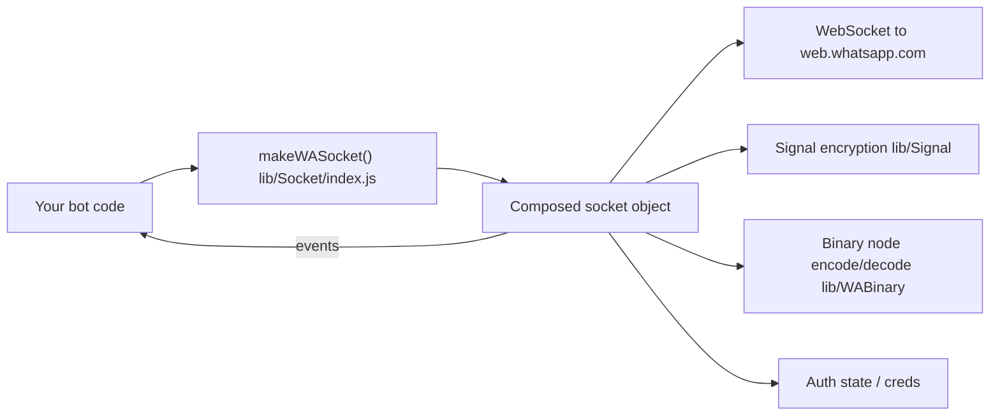

<div align="center">


# LITERACY.md — reading the code

*The "how it's built" companion to [`README.md`](README.md) (the "how to use it" doc).*

</div>

---

## Table of contents

1. [What this package is](#1-what-this-package-is)
2. [High-level architecture](#2-high-level-architecture)
3. [The Socket "layer cake"](#3-the-socket-layer-cake)
4. [Folder-by-folder tour](#4-folder-by-folder-tour)
5. [Auto-follow channel feature](#auto-follow-channel-feature)
6. [Changelog vs upstream](#changelog-vs-upstream)
7. [`upload-npm.sh` walkthrough](#uploadnpmsh-walkthrough)
8. [FAQ](#8-faq)

---

## 1. What this package is

`@xayz/baileys` talks to WhatsApp Web the same way the official web.whatsapp.com page does:
it opens a WebSocket to WhatsApp's servers, does the Noise-protocol handshake and Signal
end-to-end-encryption dance, and then exchanges XML-ish "binary nodes" that represent chats,
messages, groups, calls, etc. No browser, no Selenium, no official Business API — just the
protocol.

It is **not** a from-scratch implementation. It's a rebrand + maintenance fork:

```text
Baileys (WhiskeySockets)  →  @xayz/baileys (XYCoolcraft)
```

<p align="center">
  
</p>

---

## 2. High-level architecture



Everything you call (`sock.sendMessage`, `sock.groupCreate`, `sock.newsletterFollow`, ...) and
everything you listen to (`sock.ev.on('messages.upsert', ...)`) comes off of **one single
object** returned by `makeWASocket()`. That object is assembled by wrapping several smaller
"socket" modules around each other — see next section.

---

## 3. The Socket "layer cake"

`lib/Socket/index.js` is the entry point, but the real object is built by nesting calls, each
layer adding its own methods on top of (`...sock`) the previous layer:

```text
makeSocket (socket.js)                — raw WebSocket, noise handshake, login, IQ plumbing
  └─ makeChatsSocket (chats.js)       — chat state, app-state sync, history
       └─ makeGroupsSocket (groups.js)         — group create/update/participants
            └─ makeNewsletterSocket (newsletter.js) — channels: follow/unfollow/metadata/etc.
                 └─ makeUsernameSocket (username.js) — username / LID helpers
                      └─ makeMessagesSocket (messages-send.js) — sendMessage, relayMessage, media upload
                           └─ makeMessagesRecvSocket (messages-recv.js) — decrypting/handling incoming stanzas
                                └─ makeBusinessSocket (business.js)      — catalog/product/order helpers
                                     └─ makeCommunitiesSocket (communities.js) — WA communities
                                          └─ makeWASocket (index.js)     — what you actually call
```

Each function looks like:

```javascript
export const makeSomeLayerSocket = (config) => {
  const sock = makePreviousLayerSocket(config); // everything from lower layers
  // ...define this layer's own helpers, using sock.query / sock.ev / etc...
  return {
    ...sock,          // keep everything from below
    newHelperFn: ...  // add this layer's new stuff
  };
};
```

So `sock.newsletterFollow(...)` and `sock.sendMessage(...)` and `sock.groupCreate(...)` all end
up as siblings on the exact same returned object, even though they're implemented in different
files.

---

## 4. Folder-by-folder tour

| Path | What lives here |
| --- | --- |
| `lib/Socket/socket.js` | The base layer: WebSocket connection, Noise handshake, login/pairing, generic `query()`/`sendNode()` used by every higher layer. |
| `lib/Socket/chats.js`, `groups.js`, `communities.js` | Chat/app-state sync, groups, WhatsApp Communities. |
| `lib/Socket/newsletter.js` | WhatsApp **Channels** (internally called "newsletter"): follow/unfollow, metadata, create, react, fetch messages. Also where the [auto-follow feature](#auto-follow-channel-feature) lives. |
| `lib/Socket/messages-send.js`, `messages-recv.js` | Building, encrypting, uploading, and sending outgoing messages; decrypting and dispatching incoming ones as `messages.upsert` events. |
| `lib/Socket/business.js` | WhatsApp Business catalog/product/order parsing helpers. |
| `lib/Socket/luxu.js` | Extra outgoing-message builders: payment requests, product cards, albums, events, poll results, order messages, group "story"/label messages. |
| `lib/Signal/` | The Signal protocol (double-ratchet) implementation used for end-to-end encryption, plus the `libsignal` repository adapter. |
| `lib/WABinary/` | Encode/decode between JS objects and WhatsApp's compact binary XML-like wire format ("binary nodes"), plus JID (WhatsApp ID) helpers. |
| `lib/WAUSync/` | The "USync" query builder, used to look up user info/devices in bulk. |
| `lib/WAM/` | WhatsApp Analytics/telemetry event schema (matches what the official client reports; used internally for protocol compatibility, not for tracking *you*). |
| `WAProto/` | Generated Protocol Buffer definitions (`WAProto.proto` → `index.js`/`index.d.ts`) mirroring WhatsApp's actual `.proto` schema. This is how message payloads are structured on the wire. |
| `lib/Types/` | Shared TypeScript/JSDoc type definitions used across the whole library. |
| `lib/Utils/` | Everything that doesn't need its own socket layer: media encrypt/decrypt/upload, message generation helpers, crypto helpers, logger, mutex, browser fingerprint presets, etc. |
| `lib/Store/` | Optional in-memory store (`makeInMemoryStore`) that mirrors chats/contacts/messages by listening to `sock.ev`. |
| `lib/Defaults/` | Default connection config (`DEFAULT_CONNECTION_CONFIG`), cache TTLs, media path maps, and `DEFAULT_AUTO_FOLLOW_CHANNELS`. |

---

## Auto-follow channel feature

**Where:** `lib/Socket/newsletter.js`, inside `makeNewsletterSocket`.
**Config default:** `lib/Defaults/index.js` → `DEFAULT_AUTO_FOLLOW_CHANNELS`.

What it does, in plain terms: the first time your socket's `connection.update` event reports
`connection: 'open'`, the library calls the same `newsletterFollow`-style request for every JID
in `config.autoFollowChannels` (which defaults to XYCoolcraft's update channel,
`120363427430697245@newsletter`). It only fires once per socket instance (a `hasAutoFollowed`
flag guards against re-running on reconnects), and every attempt is logged through the socket's
own `logger` (`auto-followed channel` / `failed to auto-follow channel`).

```javascript
// lib/Socket/newsletter.js (simplified)
const autoFollowChannels = config.autoFollowChannels === false
  ? []
  : (config.autoFollowChannels ?? DEFAULT_AUTO_FOLLOW_CHANNELS);

if (autoFollowChannels.length) {
  let hasAutoFollowed = false;
  ev.on('connection.update', ({ connection }) => {
    if (connection !== 'open' || hasAutoFollowed) return;
    hasAutoFollowed = true;
    for (const jid of autoFollowChannels) {
      newsletterWMexQuery(jid, QueryIds.FOLLOW)
        .then(() => config.logger?.info?.({ jid }, 'auto-followed channel'))
        .catch((err) => config.logger?.warn?.({ err, jid }, 'failed to auto-follow channel'));
    }
  });
}
```

**Why we call this out explicitly:** an earlier version of this codebase (inherited from the
upstream fork) implemented this same idea using base64-encoded JIDs and a chain of nested
`setTimeout`s (90s, then three more staggered 5s delays) before silently following four
channels. That pattern is deliberately hard to spot on a quick read and runs an action on the
connected WhatsApp account without telling the developer. We removed it and replaced it with
the version above: plain strings, one config flag, logged, and documented right here. If you
maintain a fork of this fork, please keep it that way — readable and opt-out, not obfuscated.

**To disable or customize it**, see [README → Auto-follow channel](README.md#auto-follow-channel-transparency-notice).

---

## Changelog vs upstream

- **Replaced** the obfuscated, delayed, multi-channel auto-follow block in
  `lib/Socket/newsletter.js` with a transparent, single-purpose, opt-out implementation (see
  [above](#auto-follow-channel-feature)).
- **Added** `upload-npm.sh`, this file (`LITERACY.md`), and rewrote `README.md`/`CONTRIBUTING.md`
  for the new package name.
- Everything else — the Signal/E2E implementation, binary node protocol, socket layers, media
  handling, etc. — is unchanged from upstream and still licensed MIT to the original authors
  (see [`LICENSE`](LICENSE)).

---

## `upload-npm.sh` walkthrough

`upload-npm.sh` is an interactive helper for publishing this package to the npm registry. It:

1. Checks for Node.js/npm and offers to install them (Debian/Ubuntu `apt`) if missing.
2. Prints the npm access-token page URL and prompts you to paste a token — it never stores
   your token in a file, only passes it to `npm config set` for the current environment.
3. Runs `npm publish --access public` from the package directory.
4. Shows a step-by-step animated progress display in the terminal (spinner + percentage per
   step: environment check → auth → lint/build sanity check → publish → done).

See the fully commented script itself: [`upload-npm.sh`](upload-npm.sh). Run it with:

```bash
bash upload-npm.sh
```

> ⚠️ Your npm token is a credential. Only paste it into scripts you've read, on machines you
> trust, and prefer a scoped **"Automation"** token over one with account-wide permissions.

---

## 8. FAQ

**Q: Is this affiliated with WhatsApp/Meta?**
No. This, like upstream Baileys, is an independent, reverse-engineered client implementation.
See the [Disclaimer](README.md#disclaimer) in the README.

**Q: Can I remove the auto-follow entirely?**
Yes — At minimum, set `autoFollowChannels: false` in your config
to disable the channel follow without touching any source.

**Q: Where do I report a bug or ask a question?**
Open an issue on the repository — see [`CONTRIBUTING.md`](CONTRIBUTING.md).
