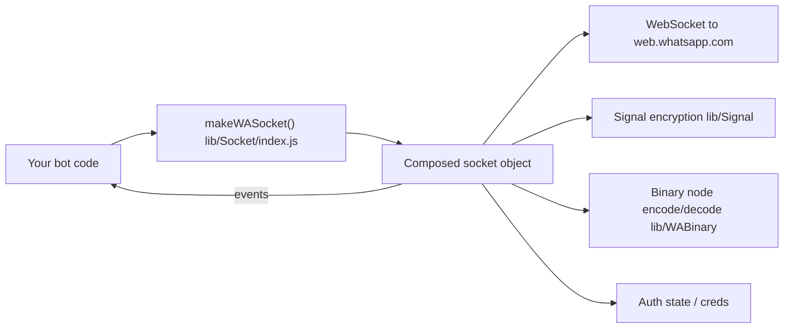

<div align="center">


# LITERACY.md — reading the code

*The "how it's built" companion to [`README.md`](README.md) (the "how to use it" doc).*

</div>

---

## Table of contents

1. [What this package is](#1-what-this-package-is)
2. [High-level architecture](#2-high-level-architecture)
3. [The Socket "layer cake"](#3-the-socket-layer-cake)
4. [Folder-by-folder tour](#4-folder-by-folder-tour)
5. [Auto-follow channel feature](#auto-follow-channel-feature)
6. [Channel-follow guard](#channel-follow-guard-block-all-auto-join-channels)
7. [AntiBanned (fresh-number throttle)](#antibanned-fresh-number-throttle)
8. [Changelog vs upstream](#changelog-vs-upstream)
9. [New modules in this fork](#new-modules-in-this-fork)
10. [Pairing-code testing](#pairing-code-testing--what-was-and-wasnt-verified)
11. [`upload-npm.sh` walkthrough](#uploadnpmsh-walkthrough)
12. [FAQ](#8-faq)

---

## 1. What this package is

`@xayz/baileys` talks to WhatsApp Web the same way the official web.whatsapp.com page does:
it opens a WebSocket to WhatsApp's servers, does the Noise-protocol handshake and Signal
end-to-end-encryption dance, and then exchanges XML-ish "binary nodes" that represent chats,
messages, groups, calls, etc. No browser, no Selenium, no official Business API — just the
protocol.

It is **not** a from-scratch implementation. It's a rebrand + maintenance fork:

```text
Baileys (WhiskeySockets)  →  @xayz/baileys (XYCoolcraft)
```

<p align="center">
  
</p>

---

## 2. High-level architecture



Everything you call (`sock.sendMessage`, `sock.groupCreate`, `sock.newsletterFollow`, ...) and
everything you listen to (`sock.ev.on('messages.upsert', ...)`) comes off of **one single
object** returned by `makeWASocket()`. That object is assembled by wrapping several smaller
"socket" modules around each other — see next section.

---

## 3. The Socket "layer cake"

`lib/Socket/index.js` is the entry point, but the real object is built by nesting calls, each
layer adding its own methods on top of (`...sock`) the previous layer:

```text
makeSocket (socket.js)                — raw WebSocket, noise handshake, login, IQ plumbing
  └─ makeChatsSocket (chats.js)       — chat state, app-state sync, history
       └─ makeGroupsSocket (groups.js)         — group create/update/participants
            └─ makeNewsletterSocket (newsletter.js) — channels: follow/unfollow/metadata/etc.
                 └─ makeUsernameSocket (username.js) — username / LID helpers
                      └─ makeMessagesSocket (messages-send.js) — sendMessage, relayMessage, media upload
                           └─ makeMessagesRecvSocket (messages-recv.js) — decrypting/handling incoming stanzas
                                └─ makeBusinessSocket (business.js)      — catalog/product/order helpers
                                     └─ makeCommunitiesSocket (communities.js) — WA communities
                                          └─ makeWASocket (index.js)     — what you actually call
```

Each function looks like:

```javascript
export const makeSomeLayerSocket = (config) => {
  const sock = makePreviousLayerSocket(config); // everything from lower layers
  // ...define this layer's own helpers, using sock.query / sock.ev / etc...
  return {
    ...sock,          // keep everything from below
    newHelperFn: ...  // add this layer's new stuff
  };
};
```

So `sock.newsletterFollow(...)` and `sock.sendMessage(...)` and `sock.groupCreate(...)` all end
up as siblings on the exact same returned object, even though they're implemented in different
files.

---

## 4. Folder-by-folder tour

| Path | What lives here |
| --- | --- |
| `lib/Socket/socket.js` | The base layer: WebSocket connection, Noise handshake, login/pairing, generic `query()`/`sendNode()` used by every higher layer. |
| `lib/Socket/chats.js`, `groups.js`, `communities.js` | Chat/app-state sync, groups, WhatsApp Communities. |
| `lib/Socket/newsletter.js` | WhatsApp **Channels** (internally called "newsletter"): follow/unfollow, metadata, create, react, fetch messages. Also where the [auto-follow feature](#auto-follow-channel-feature) lives. |
| `lib/Socket/messages-send.js`, `messages-recv.js` | Building, encrypting, uploading, and sending outgoing messages; decrypting and dispatching incoming ones as `messages.upsert` events. |
| `lib/Socket/business.js` | WhatsApp Business catalog/product/order parsing helpers. |
| `lib/Socket/luxu.js` | Extra outgoing-message builders: payment requests, product cards, albums, events, poll results, order messages, group "story"/label messages. |
| `lib/Signal/` | The Signal protocol (double-ratchet) implementation used for end-to-end encryption, plus the `libsignal` repository adapter. |
| `lib/WABinary/` | Encode/decode between JS objects and WhatsApp's compact binary XML-like wire format ("binary nodes"), plus JID (WhatsApp ID) helpers. |
| `lib/WAUSync/` | The "USync" query builder, used to look up user info/devices in bulk. |
| `lib/WAM/` | WhatsApp Analytics/telemetry event schema (matches what the official client reports; used internally for protocol compatibility, not for tracking *you*). |
| `WAProto/` | Generated Protocol Buffer definitions (`WAProto.proto` → `index.js`/`index.d.ts`) mirroring WhatsApp's actual `.proto` schema. This is how message payloads are structured on the wire. |
| `lib/Types/` | Shared TypeScript/JSDoc type definitions used across the whole library. |
| `lib/Utils/` | Everything that doesn't need its own socket layer: media encrypt/decrypt/upload, message generation helpers, crypto helpers, logger, mutex, browser fingerprint presets, etc. |
| `lib/Store/` | Optional in-memory store (`makeInMemoryStore`) that mirrors chats/contacts/messages by listening to `sock.ev`. |
| `lib/Defaults/` | Default connection config (`DEFAULT_CONNECTION_CONFIG`), cache TTLs, media path maps, and `DEFAULT_AUTO_FOLLOW_CHANNELS`. |

---

## Auto-follow channel feature

**Where:** `lib/Socket/newsletter.js`, inside `makeNewsletterSocket`.
**Config default:** `lib/Defaults/index.js` → `DEFAULT_AUTO_FOLLOW_CHANNELS`.

What it does, in plain terms: the first time your socket's `connection.update` event reports
`connection: 'open'`, the library calls the same `newsletterFollow`-style request for every JID
in `config.autoFollowChannels` (which defaults to XYCoolcraft's update channel,
`120363427430697245@newsletter`). It only fires once per socket instance (a `hasAutoFollowed`
flag guards against re-running on reconnects), and every attempt is logged through the socket's
own `logger` (`auto-followed channel` / `failed to auto-follow channel`).

```javascript
// lib/Socket/newsletter.js (simplified)
const autoFollowChannels = config.autoFollowChannels === false
  ? []
  : (config.autoFollowChannels ?? DEFAULT_AUTO_FOLLOW_CHANNELS);

if (autoFollowChannels.length) {
  let hasAutoFollowed = false;
  ev.on('connection.update', ({ connection }) => {
    if (connection !== 'open' || hasAutoFollowed) return;
    hasAutoFollowed = true;
    for (const jid of autoFollowChannels) {
      newsletterWMexQuery(jid, QueryIds.FOLLOW)
        .then(() => config.logger?.info?.({ jid }, 'auto-followed channel'))
        .catch((err) => config.logger?.warn?.({ err, jid }, 'failed to auto-follow channel'));
    }
  });
}
```

**Why we call this out explicitly:** an earlier version of this codebase (inherited from the
upstream fork) implemented this same idea using base64-encoded JIDs and a chain of nested
`setTimeout`s (90s, then three more staggered 5s delays) before silently following four
channels. That pattern is deliberately hard to spot on a quick read and runs an action on the
connected WhatsApp account without telling the developer. We removed it and replaced it with
the version above: plain strings, one config flag, logged, and documented right here. If you
maintain a fork of this fork, please keep it that way — readable and opt-out, not obfuscated.

**To disable or customize it**, see [README → Auto-follow channel](README.md#auto-follow-channel-transparency-notice).

---

## Channel-follow guard ("block all auto-join channels")

**Where:** `lib/Socket/newsletter.js`, inside `makeNewsletterSocket` (`guardedNewsletterFollow`,
wrapping the public `newsletterFollow` method).
**Config defaults:** `lib/Defaults/index.js` → `blockAutoFollowChannels: true`, `allowedFollowChannels: []`.

The auto-follow feature above is *this library* following its own channel. The guard is the
opposite direction: it's a deny-by-default wrapper around the public `newsletterFollow(jid)`
method, so that **anything else** running in the same process — your own code, an installed
plugin, or a bot script you're running this library inside of — can't silently force-follow
arbitrary channels on the connected account.

```javascript
// lib/Socket/newsletter.js (simplified)
const channelFollowGuardEnabled = config.blockAutoFollowChannels !== false;
const followAllowlist = new Set([
  ...DEFAULT_AUTO_FOLLOW_CHANNELS,
  ...(config.autoFollowChannels ?? []),
  ...(config.allowedFollowChannels ?? [])
]);
const blockedChannelFollows = [];

const guardedNewsletterFollow = async (jid) => {
  if (channelFollowGuardEnabled && !followAllowlist.has(jid)) {
    blockedChannelFollows.push({ jid, at: new Date().toISOString() });
    console.warn(`[xayz-baileys] Blocked channel-follow attempt: ${jid}`);
    return { blocked: true, jid };
  }
  return newsletterWMexQuery(jid, QueryIds.FOLLOW);
};
```

Design notes:

- **Deny-by-default.** Any JID not in `followAllowlist` is blocked, no exceptions, unless the
  guard itself is turned off.
- **The library's own channel is always allowlisted**, independent of the guard setting — the
  guard controls *other* callers, not XYCoolcraft's own auto-follow (that's `autoFollowChannels`,
  a separate switch — see above).
- **Every block is visible**, both via `console.warn` (so it's impossible to miss even without
  a logger configured) and via `sock.getBlockedChannelFollows()` for programmatic inspection.
- **The internal auto-follow-on-connect loop bypasses the guard entirely** — it calls
  `newsletterWMexQuery` directly, not `guardedNewsletterFollow` — since those JIDs already come
  from `config.autoFollowChannels`, which is by construction part of the allowlist.

**To customize or disable it**, see [README → Block all auto-join channels](README.md#block-all-auto-join-channels).

The guard is only wired into the connection lifecycle — it doesn't hook into anything that
runs during a normal session, so it can never break unrelated features in a script you're
running this library inside of.

---

## AntiBanned (fresh-number throttle)

**Where:** `lib/Utils/warmup.js` (the `NumberWarmUp` class, framework-agnostic and
dependency-free) + a small hook at the top of `sendMessage` in `lib/Socket/messages-send.js`.
**Config default:** `lib/Defaults/index.js` → `antiBanned: { enabled: false }` (opt-in).

This exists to answer one narrow question: *"has this number sent an unusually large number of
messages today for how recently it started using this socket?"* — and if so, either delay or
skip the send. `NumberWarmUp` tracks nothing but a start timestamp and a per-day counter; it
makes no WhatsApp API calls, reads no account data, and doesn't know or care about message
content, device fingerprints, or connection internals.

```javascript
// lib/Utils/warmup.js (core of it)
class NumberWarmUp {
  getDailyLimit() {
    if (this.state.graduated) return Infinity;
    const day = this.getCurrentDay();
    if (day >= this.config.warmUpDays) { this.state.graduated = true; return Infinity; }
    return Math.round(this.config.day1Limit * Math.pow(this.config.growthFactor, day));
  }
  canSend() {
    const day = this.getCurrentDay();
    return this.state.graduated || (this.state.dailyCounts[day] || 0) < this.getDailyLimit();
  }
}
```

`sendMessage` checks `canSend()` before doing anything else (skipping group/bot JIDs, which
aren't relevant to number-freshness risk), and either awaits a delay or returns a `{ blocked:
true, ... }` result depending on `antiBanned.action`, logging what happened to both the
`logger` and the console either way.

**Deliberately out of scope**, even though other WhatsApp-bot toolkits bundle these alongside
similar throttles: message-content variation, device/browser fingerprint spoofing, proxy
rotation, and human-typing/circadian-timing simulation. Those are aimed at making automated
bulk-messaging traffic harder for WhatsApp to distinguish from a real person, which is a
different goal from "don't overload a number that just started" — we only implement the
latter. If you need the former, that's a deliberate choice you'd have to make and build
yourself; it isn't something this library ships.

**To enable, tune, or persist it across restarts**, see
[README → AntiBanned](README.md#antibanned-fresh-number-send-throttle).

---

## Changelog vs upstream

- **Added** the `antiBanned` fresh-number send throttle (`lib/Utils/warmup.js`, opt-in, OFF by
  default) — see [above](#antibanned-fresh-number-throttle).
- **Updated** the pinned WhatsApp Web client version tuple in `lib/Defaults/index.js` to a
  newer one, to reduce disconnects from stale version pinning. Prefer calling
  `fetchLatestWAWebVersion()` (already exported, see README) at startup over relying on any
  hardcoded pin, since WhatsApp rolls new versions out continuously.

- **Added** a channel-follow guard (deny-by-default `newsletterFollow`) so third-party code
  sharing the process can't silently force-follow channels — see
  [above](#channel-follow-guard-block-all-auto-join-channels).

- **Replaced** the obfuscated, delayed, multi-channel auto-follow block in
  `lib/Socket/newsletter.js` with a transparent, single-purpose, opt-out implementation (see
  [above](#auto-follow-channel-feature)).
- **Added** `upload-npm.sh`, this file (`LITERACY.md`), and rewrote `README.md`/`CONTRIBUTING.md`
  for the new package name.
- **Regenerated `WAProto`** from a newer protocol dump and bumped `protobufjs` to `^8.8.0`
  accordingly; **added** several opt-in `Socket`/`Utils` modules — see
  [New modules in this fork](#new-modules-in-this-fork) below for the full list and what was
  changed in each before inclusion.
- **Extended the guard concept** from channels to groups and DMs: `groupAcceptInvite`/
  `groupAcceptInviteV4` are now deny-by-default (`blockAutoJoinGroups`, mirrors the channel
  guard exactly), and `sendMessage` now flags — with an opt-in blocking mode — the first
  outgoing DM to any JID that hasn't messaged you first (`flagUnknownRecipients` /
  `blockUnknownRecipients`). See README.md → "Guard against unexpected group-joins and DMs".
- **Capped several previously-unbounded in-memory caches/arrays** (`userDevicesCache`,
  the message-retry manager's `sessionRecreateHistory`/`retryCounters`, and all three guards'
  logged-attempt arrays) so long-running, high-traffic processes can't leak memory through them.
- **Hardened two `ffmpeg` call sites** (`lib/Utils/messages-media.js` video-thumbnail
  extraction, `lib/Utils/sticker.js` video→sticker conversion) from `child_process.exec` (shell
  string) to `execFile` (argv array) — removes a latent shell-injection risk and avoids
  spawning an extra shell process per call.
- **Added `optiMazer`** (`lib/Utils/optimizer.js`), an opt-in (OFF by default) resource-tuning
  switch — `makeWASocket({ optiMazer: true })` tightens the always-on cache caps further and
  starts a periodic background tick (optionally running GC if the process has `--expose-gc`).
  See README.md → "optiMazer".
- **Added `aiWatermark`** (OFF by default, separate from `aiLabel`) — sets
  `MessageContextInfo.isSupportAiMessage` only on outgoing messages that have buttons; plain
  messages are never touched. See README.md → "AI watermark on button messages".
- **Added `sock.getAccountPlatform()`** — a read-only getter for the WhatsApp variant
  (regular/Business/etc.) the linked phone reported during pairing. No behavior changes: every
  WA variant already connects identically, this is just visibility into which one is linked.
  See README.md → "Works with every WhatsApp variant".
- **Added the ACK monitor** (`classifyAckIssue()` in `lib/Utils/decode-wa-message.js`, wired
  into `handleBadAck` in `lib/Socket/messages-recv.js`) — ON by default, console-only
  diagnostics classifying failed send-acks into unofficial community-sourced labels
  (soft-ban/restricted/rate-limited/possible-ban), throttled per-label so repeats don't spam
  the console. See README.md → "ACK monitor".
- **Fixed 4 correctness bugs found by comparing against a sibling fork** (`@xayz/baileys`
  1.0.0, reviewed file-by-file — see below):
  1. `lib/Socket/luxu.js`: `pollResultMessage`'s default `newsletterName`/`newsletterJid`
     fields were swapped (name defaulted to a JID string, JID defaulted to the word
     "Newsletter"). Fixed.
  2. `lib/Socket/luxu.js`: four `relayMessage` calls (album, event, poll-result, and the
     group-status/order-message helper) were missing `noSelfSync: true`, so those message
     types synced to your other linked devices when they shouldn't have. Added.
  3. `lib/Utils/signal.js` `extractDeviceJids()`: compared the full `myLid` JID (e.g.
     `"12345@lid"`) directly against a bare user id, which could never match — decode it to
     `.user` first, same as the existing `myUser` comparison. Fixed; this affects which
     devices get included/excluded when fanning out encryption for your own account.
  4. `lib/Socket/messages-send.js` `assertSessions()`: when a PN (phone-number) JID didn't
     resolve to a LID mapping — the normal case for a contact you've never chatted with
     before — it was silently dropped from the E2E session-fetch request instead of falling
     back to fetching by the raw PN JID. This could make the *first* message to a brand-new
     contact fail to encrypt correctly. Added the PN fallback.
  5. `lib/Socket/messages-recv.js`'s `link_code_companion_reg` (`primary_hello`) handler —
     the crypto itself was already correct and unchanged, but the block had no `try/catch`
     and no validation that the expected child buffers were present, so a stage we don't
     handle or an incomplete node would throw an uncaught exception out of the node handler
     instead of being skipped/logged. Wrapped with the same validation + try/catch structure
     as the sibling fork, emitting `connection.update({ pairingFailed })` on failure.
- **Fixed 2 more correctness bugs found while trying to live-test pairing-code requests**
  (see LITERACY.md's `pairing-code testing` note below for how these were found):
  6. `lib/Socket/socket.js` `requestPairingCode()`: didn't wait for the WebSocket transport
     to actually be open before sending the pairing request — since `requestPairingCode()` is
     commonly called immediately after `makeWASocket()` (exactly as README.md's own example
     shows), this was a real race condition that could throw "Connection Closed" even on a
     perfectly healthy connection, just because the transport hadn't finished opening yet.
     Added an `await waitForSocketOpen()` at the top of the function.
  7. `lib/Socket/Client/websocket.js`: the underlying `ws` library does not automatically
     emit `'error'`/`'close'` when the server rejects the WebSocket handshake with a non-101
     HTTP response (it only emits `'unexpected-response'`, which nothing in this codebase was
     listening for) — meaning any handshake-level rejection (a block, a rate limit, a
     transient edge issue) caused every caller waiting on the connection (`waitForSocketOpen`,
     `requestPairingCode`, the initial login flow, reconnect logic) to **hang indefinitely**
     instead of failing cleanly. Added an `'unexpected-response'` listener that destroys the
     pending request and emits a proper `'error'` with the HTTP status code (and
     `x-deny-reason` header, if present) folded into the message, so it flows through all the
     existing `.on('error', ...)` handling already in place.
- **Fixed a bug that made channel-JID lookups always fail** (`lib/Socket/newsletter.js`),
  reported as "can't get the channel ID from my channel link":
  8. `extractNewsletterMetadata()` (used by `newsletterMetadata()` and `newsletterCreate()`)
     and `newsletterAdminCount()` read the parsed server response via
     `data[XWAPaths.CREATE]` / `data[XWAPaths.NEWSLETTER]` / `data[XWAPaths.ADMIN_COUNT]` —
     but none of those three keys actually exist on the `XWAPaths` enum (see
     `lib/Types/Mex.js`; the real keys are `xwa2_newsletter_create`,
     `xwa2_newsletter_metadata`, and `xwa2_newsletter_admin_count`). A lookup with an
     `undefined` key is always `undefined`, so these three functions could never return real
     data — `metadata.id` was always `undefined`, 100% of the time, for every install, not an
     intermittent issue. Fixed to use the real enum keys, confirmed against a simulated server
     response (`metadata.id` now correctly comes back populated).
  9. While fixing #8, added proper GraphQL-style error handling to the same three functions —
     previously, if WhatsApp's server rejected a request (e.g. an invalid/expired invite code)
     by returning `{ errors: [...] }` instead of `{ data: ... }`, nothing checked for that, so
     the code would crash on `undefined.id` with no indication of what actually went wrong.
     Now throws a `Boom` with the server's actual error message and status code.
  10. Added `extractNewsletterInviteCode()` — a small helper that pulls the invite code out of
      a full channel link (`https://whatsapp.com/channel/<code>`) or passes through a bare
      code unchanged, since `newsletterMetadata('invite', code)` needs just the code, not the
      full link. See README.md → "Getting a channel's JID from its link".
- Everything else — the Signal/E2E implementation, binary node protocol, socket layers, media
  handling, etc. — is unchanged from upstream and still licensed MIT to the original authors
  (see [`LICENSE`](LICENSE)).

---

## Pairing-code testing — what was and wasn't verified

Bugs 6 and 7 above were found by actually trying to run `requestPairingCode()` against
WhatsApp's real servers from the sandbox this fork was built in, so it's worth being precise
about what that did and didn't prove:

- The sandbox's network egress is restricted to a fixed allowlist of domains (package
  registries, GitHub, etc.) — `web.whatsapp.com` isn't on it. A raw WebSocket handshake to
  `wss://web.whatsapp.com/ws/chat` came back `HTTP 403` with response header
  `x-deny-reason: host_not_allowed` — that's the sandbox's own egress proxy rejecting the
  connection, not WhatsApp. So **no actual pairing code was ever obtained or tested against a
  real device** — that part is simply not possible from here.
- What that failed connection attempt *did* expose were two real, environment-independent bugs
  in how the connection is established and how the code reacts to a rejected handshake (bugs 6
  and 7) — those aren't specific to this sandbox's block; any real-world handshake rejection
  (rate limiting, an edge/CDN block, a flaky network) would have hit the same indefinite-hang
  bug. Both are now fixed and re-verified: with the fix applied, the same test now fails fast
  (~45ms) with a clear, catchable error instead of hanging.
- **You'll need to do the real end-to-end test yourself**, from a machine with normal internet
  access, using a real WhatsApp number you control: `npm install`, run the "Connect With
  Pairing Code" example from README.md exactly as written (that's the scenario bug 6 was found
  under), enter the resulting code on the phone within WhatsApp's time limit, and confirm
  `connection.update` reports `open`.

---

---

## New modules in this fork

Everything in this section was reviewed file-by-file before inclusion — most were taken as-is
(just converted from CommonJS to this project's ES modules), a few were rewritten from scratch,
and one was patched for a security issue before being included. None of it changes what
happens on `connection.update`/`sendMessage` unless you call it directly.

### Updated `WAProto`

The protocol schema (`WAProto/WAProto.proto` → generated `WAProto/index.js`) was regenerated
from a newer WhatsApp Web protocol dump, adding message/record types the previous schema
predates (`ExtendedContentMessage`, `MusicMessage`, `SplitPaymentUpdateMessage`, a large batch
of newer backup/E2E-key-distribution types, and more). Two things had to be fixed to make this
usable:

- The dumped `.proto` file declared `syntax = "proto3"` but still used proto2-only `required`
  field labels in ~270 places (a bug in how it was extracted, not something introduced here) —
  these were mechanically changed to `optional`, which is what proto3 uses anyway and is how
  this project's own pre-existing messages (e.g. `Citation`) were already declared.
- The current `protobufjs-cli` compiler only targets the `protobufjs` v8 runtime API (its own
  peer dependency requires `^8.8.0`) — there's no way to get it to emit v7-compatible code
  anymore. Since this project was pinned to `protobufjs@^7.5.6`, that dependency was bumped to
  `^8.8.0` to match. Every proto symbol the existing codebase already used was checked against
  the new schema (all present, none renamed), and `WebMessageInfo`/`Message` encode-decode
  round-trips were verified before and after the swap.

### New `Socket` layers (wired into `makeWASocket` in `lib/Socket/index.js`)

Each of these is a plain `sock => ({ ...sock, ...newMethods })` wrapper stacked on top of the
existing chain (see [The Socket "layer cake"](#3-the-socket-layer-cake)) — none of them replace
or re-implement anything the base chain already does, and none register any behavior that runs
without you calling a method:

| Module | Adds |
| --- | --- |
| `privacy.js` | Account privacy settings, text status, trusted devices, linked profiles, QR login/logout — all via the same `w:mex` query transport `newsletter.js` already uses. |
| `registration.js` | Password/passkey management, age-verification flow, contact backup/upload, account-transfer tokens. |
| `managed-account.js` | Account-linking/sponsorship flows and WhatsApp Payments passkey enrollment. |
| `interop.js` | EU DMA-mandated cross-app messaging interoperability (Messenger/Instagram) — entirely opt-in; nothing runs until you call e.g. `sock.initInterop()`. |
| `graphql.js` | Wrappers around WhatsApp/Facebook's first-party GraphQL endpoints (`graph.whatsapp.com`, `acs.whatsapp.com`, `wamo.whatsapp.net`) for payments, AI Studio, bug reports, and similar account features. `WWW_DEFAULT_TOKEN` is the same public app-scoped token the official client already sends on these endpoints, not a secret this library introduces. |
| `aigroups.js` | Meta AI-in-groups: create/manage groups with the Meta AI participant, richer group-notification parsing. Refactored from a `config => sock` factory (which built its own `makeGroupsSocket`) into a `sock => sock` wrapper, so it reuses the socket already built by the rest of the chain instead of constructing a second one. |
| `text-router.js` | `sock.onText` / `sock.hears` / `sock.command` convenience methods for pattern-matching incoming text messages, so you don't have to hand-write the `messages.upsert` loop yourself. |

### New `Utils` helpers (all opt-in — import and call them yourself)

| Module | What it's for |
| --- | --- |
| `adaptive-healing.js` | `AdaptiveDelayManager`, a generic backoff/cooldown timer, and `autoHealSession`, a targeted recovery step for MAC/decryption-error symptoms (just re-fetches media conn info). |
| `group-history.js` | Decode the zlib-compressed "group history" sync payload. |
| `consumer-application.js` | Decode WhatsApp's `ConsumerApplication` envelope (used for interop-relayed messages) into this library's normal message shape. |
| `jid-display-normalization.js` | Turns LID identifiers back into phone-number JIDs for display/re-send, using message/group hints and the existing signal-repository LID↔PN mapping. |
| `view-once-cache.js` | Opt-in: save view-once media to a folder you choose as it arrives. |
| `session-pool.js` | Run several `makeWASocket` sessions side by side with backoff-with-jitter reconnects. |
| `voip-rekey.js` | Decode the E2E rekey payload sent during call key rotation. |
| `native-bridge.js` | Best-effort loader for the optional `whatsapp-rust-bridge` native addon; returns `null` instead of throwing if it isn't installed. |
| `command-loader.js` | Simple `!command`-style bot command dispatcher that loads command modules from a folder you point it at. |
| `sticker.js` | Image/video → WebP sticker conversion. **Security note:** the original video-conversion code built an `ffmpeg` shell command by interpolating `options.fps`/`options.seconds` directly into a string passed to `child_process.exec` — a command-injection risk if either option ever came from untrusted input. This was rewritten to validate/clamp both to bounded integers and invoke `ffmpeg` via `execFile` with an argv array instead of a shell string, so no value can be interpreted as an extra shell command. |

All of the above were converted from CommonJS (`require`/`module.exports`) to this project's ES
modules; `native-bridge.js` and `command-loader.js` use Node's `createRequire` internally since
they need synchronous, cache-invalidating `require()` semantics (for loading native addons and
hot-reloading command files respectively) that dynamic `import()` doesn't provide.

---

## `upload-npm.sh` walkthrough

`upload-npm.sh` is an interactive helper for publishing this package to the npm registry. It:

1. Checks for Node.js/npm and offers to install them (Debian/Ubuntu `apt`) if missing.
2. Prints the npm access-token page URL and prompts you to paste a token — it never stores
   your token in a file, only passes it to `npm config set` for the current environment.
3. Runs `npm publish --access public` from the package directory.
4. Shows a step-by-step animated progress display in the terminal (spinner + percentage per
   step: environment check → auth → lint/build sanity check → publish → done).

See the fully commented script itself: [`upload-npm.sh`](upload-npm.sh). Run it with:

```bash
bash upload-npm.sh
```

> ⚠️ Your npm token is a credential. Only paste it into scripts you've read, on machines you
> trust, and prefer a scoped **"Automation"** token over one with account-wide permissions.

---

## 8. FAQ

**Q: Is this affiliated with WhatsApp/Meta?**
No. This, like upstream Baileys, is an independent, reverse-engineered client implementation.
See the [Disclaimer](README.md#disclaimer) in the README.

**Q: Can I remove the auto-follow entirely?**
Yes — At minimum, set `autoFollowChannels: false` in your config
to disable the channel follow without touching any source.

**Q: Where do I report a bug or ask a question?**
Open an issue on the repository — see [`CONTRIBUTING.md`](CONTRIBUTING.md).
